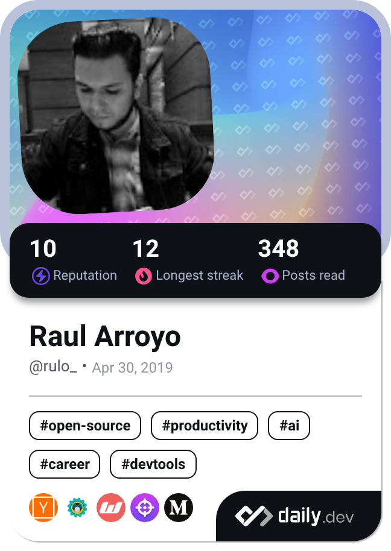

<h1 align="center">Raul Arroyo</h1>

  <strong>Mobile Developer | 15+ Years Engineering Scalable Cross-Platform Apps</strong>

  
    
  <em>Senior Multiplatform Developer • Kotlin Multiplatform • iOS • Flutter</em>

---

## About Me

**Building production-grade mobile experiences** specializing in Flutter, Android, iOS and scalable app architectures. Passionate about clean code, performance optimization, and integrating AI tools.

- **Delivering** native & cross-platform mobile apps with clean architecture, full CI/CD pipelines, and production-grade scalability
- **Expertise** Cross-platform development, mobile architecture, CI/CD pipelines, team leadership
- **Open to collaborate** on scalable Flutter projects, KMP initiatives, or mobile architecture discussions

---

## Tech Stack

### Core Mobile Platforms

### Architecture Patterns

### Testing Suite

### Modern AI Integration

### Backend Infrastructure

### Production CI/CD

---

> 

>   
> 

---

## Let's Connect

  

---

Clean, <b>scalable solutions</b> <em>no extra complexity</em>.

