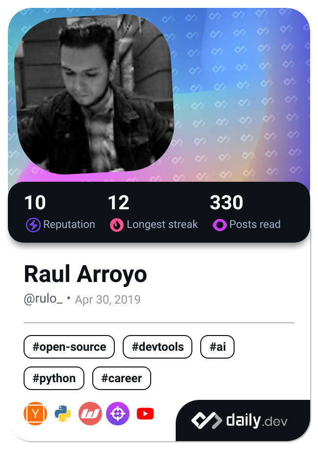

<h1 align="center">Hey there! I'm R̴̡̮̻̤̫͙̒͗̌͊u̷̡̻̩̹̣̺̝͐̃̆͑͑̄̿̌ͅͅl̷̘̠̽̈́͗̎̽o̶̘̓́͐̏̔</h1>
<h2 align="center">A mobile developer, I'm passionate about creating mobile apps and automating tasks with Python.</h2>
<h3 align="left"> Here's a bit more about what I'm up to: </h3>

**I’m currently working on** developing mobile apps and automating tasks to streamline processes and boost efficiency, all with the power of Python.

**I’m looking to collaborate on** exciting projects related to mobile development or anything that pushes the boundaries of technology. Let's team up and create something awesome!

**I’m looking for help with** enhancing the user experience in current mobile projects and optimizing its performance to deliver the best possible results.

**I’m currently learning** advanced techniques in mobile app design and development, with a particular focus on mastering Flutter for cross-platform excellence, ML / IA enthusiast.

**Ask me about** whether it's design, app development, or even my go-to snacks for those marathon coding sessions, feel free to shoot me a message – I'm all ears!

---
## Socials
 

 

## Tech Stack

### Project Management and Methodologies

### Networking and Protocols

### Cloud Computing

### Programming languages

 
 

 

 

 

### Frameworks and Libraries

 

### Databases

 
 
 
 

 
 

### CICD

### Other Tools

 
 
 

 

 

 
 
 

 

 

 

 
 

 

 

 

##  GitHub Stats
 

## Dev Quote

## Dev Card

 

---

